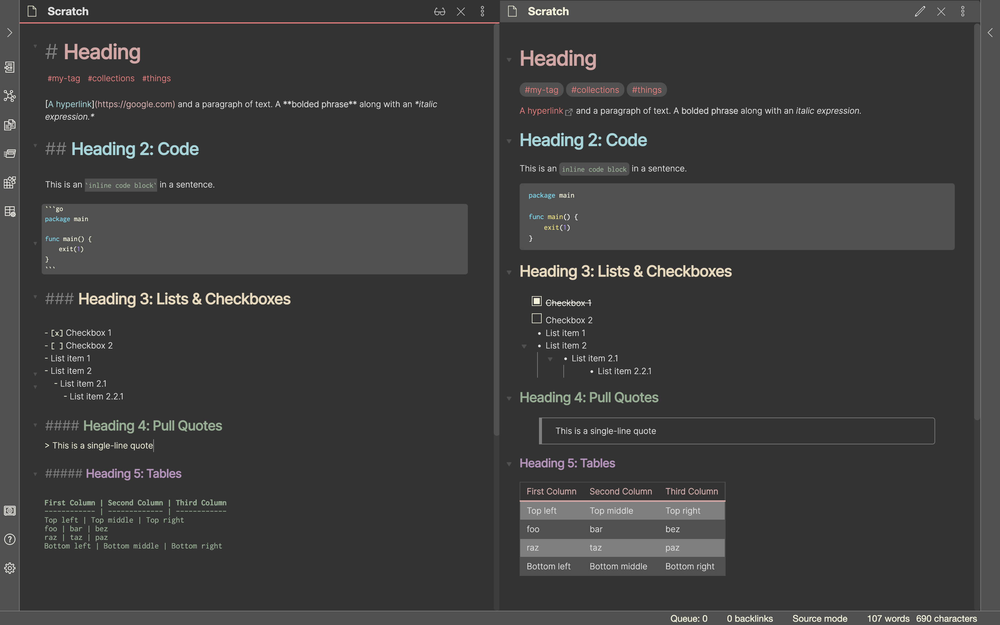

# Obsidian Zenburn

Zenburn, the classic low-contrast vim theme, is now available in Obsidian. Dark mode only.

This theme is best paired with [Inter UI](https://rsms.me/inter/) and [Inconsolata](https://fonts.google.com/specimen/Inconsolata).

What's Zenburn, you ask? [Well, let me enlighten you.](https://github.com/jnurmine/Zenburn)

## Installation
- Options > Appearance > Manage > Search for "Zenburn" > "Install and use"
