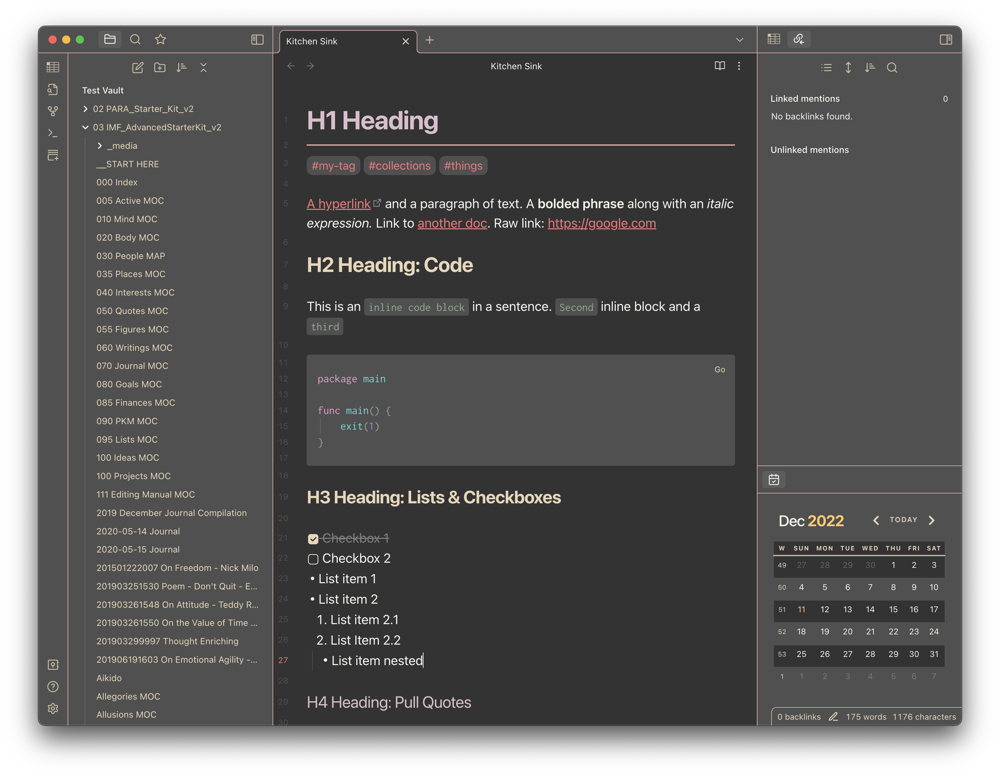

# Obsidian Zenburn

Zenburn, the classic low-contrast vim theme, is now available in Obsidian. Dark mode only.

This theme is best paired with [Inter UI](https://rsms.me/inter/) and [Inconsolata](https://fonts.google.com/specimen/Inconsolata).

What's Zenburn, you ask? [Well, let me enlighten you.](https://github.com/jnurmine/Zenburn)

## Installation
- Open your **Settings**
- Under **Options** > **Appearance**, click **Manage** and search for "Zenburn"
- On the theme description, click the **Install and use** and you're set!

## Feedback
Please [open an issue](https://github.com/danyim/obsidian-zenburn/issues) on this repo for any feedback or comments.

